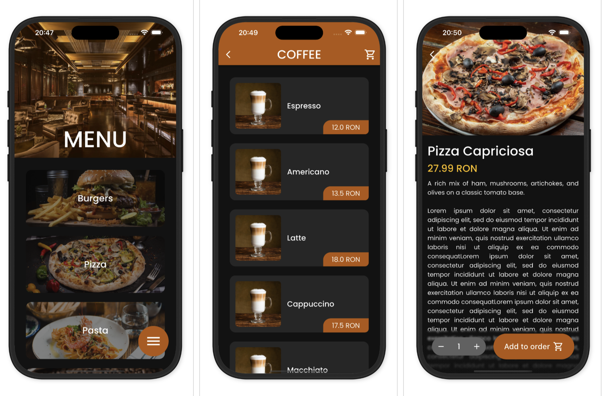
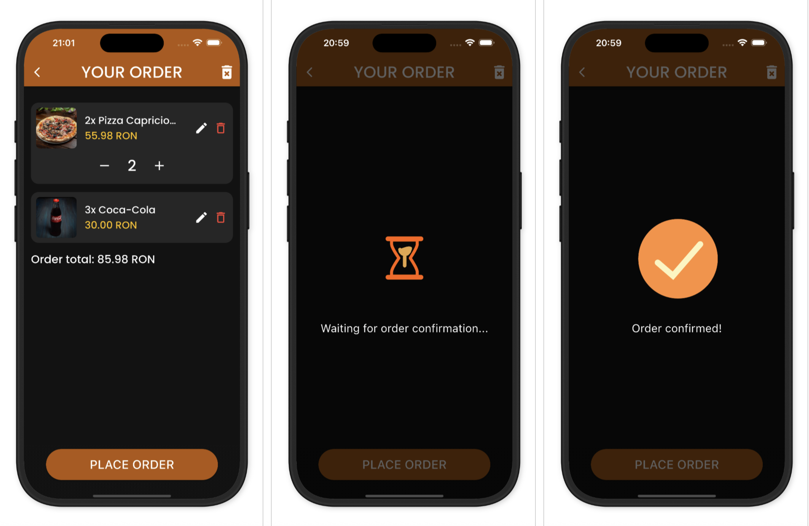
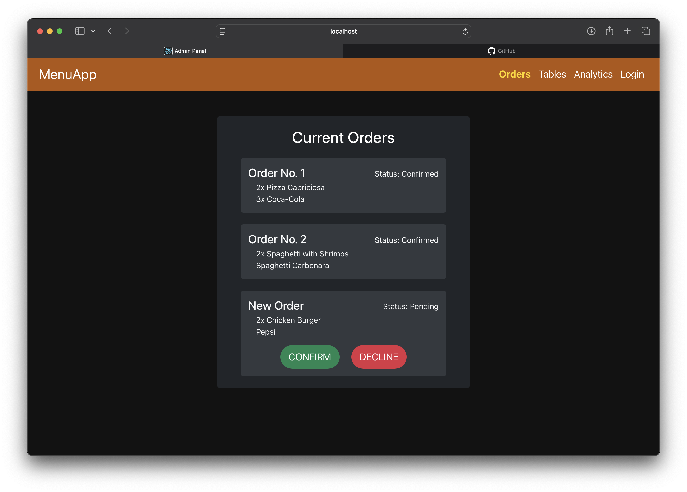
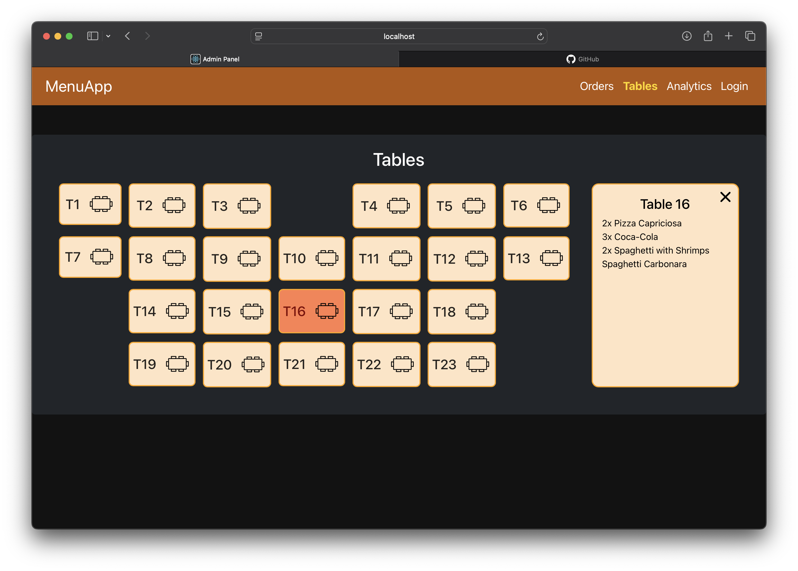

# MenuApp

A modern **cross-platform** application designed for restaurants, pubs or bars, which works as a **digital menu**. The app offers a seamless experience on both **iOS** and **Android smartphones**, combining functionality with a good looking design.

## Key features

### 🛒 Integrated order system
Customers can explore the menu, organized in multiple categories, customize their selections and send them to the kitchen in real time. The system ensures an excellent ordering experience with clear communication between guests and staff.

### 📷 QR code scanning
Users can scan a QR code placed on their table to instantly open the digital menu within the app. They can view past orders, place new ones or even send a direct request to the staff.

### ⚙️ Admin panel
The app comes with a web-based admin panel built from scratch that offers multiple core management options. It includes an order tracking dashboard, a visual table grid displaying current orders for each table and (🔜) detailed analytics. The admin panel is fully responsive, ensuring a smooth experience across all devices.

### 🎨 Smooth animations
Designed to offer a polished experience and instant visual feedback on users' order status by adding animations based on kitchen updates.

### 💾 Scalable data storage
Utilizing MongoDB, the system provides a flexible and robust data foundation. It manages everything from nested order details to long-term analytics, ensuring real-time synchronization and smooth performance.

## Screenshots

### 📱 Mobile app

### 🖥️ Admin panel

## Tech stack
- **App**: Flutter & other Flutter packages
- **Admin panel**: React, Bootstrap, Node.js
- **Backend**: Node.js, Express, MongoDB
- **Other**: REST API, Websockets

## Roadmap
- ✅ Ordering system
- ✅ QR code integration
- ✅ Order tracking on admin panel
- ✅ Integration with a scalable & reliable database
- 🔜 Secure login system for admins
- 🔜 Analytics dashboard on the panel
- 🔜 In-app payment functionalities

## Author
Developed with passion by **</ [Damian Cosmin](http://github.com/DamianCosmin) >**